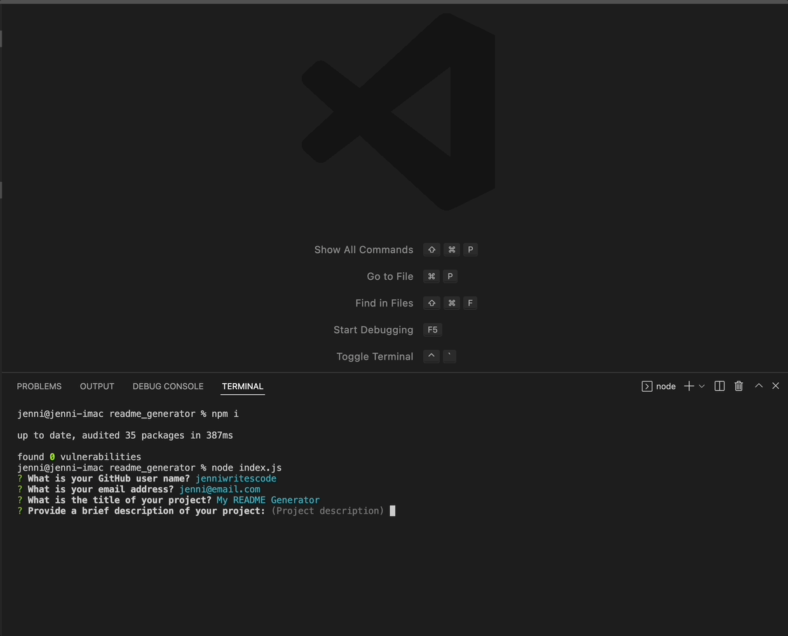

# Markdown Generator

## Table of contents

- [Description](#description)
- [User Story](#user-story)
- [Installation Instructions](#installation)
- [Working Example](#working-example)
- [Example Output](#example-output-readme-file)
- [Links](#links)


## Description

Interactive command line application requests input from the user to generate a README file (in markdown format).


## User Story

```
AS A developer
I WANT a README generator
SO THAT I can quickly create a professional README for a new project
```

## Installation Instructions

*Prerequisites*: node.js version 8.x should be installed on your system, please follow [these instructions](https://nodejs.org/en/download/) to install if needed.

To run this program, download the source code (using `git clone` or by downloading the .zip file). Unzip file if needed. Open a Terminal window, navigate to the directory for readme_generator, and run the following commands in the terminal:

    npm i

then

    node index.js

## Working Example



## Example Output README File


## Links

[Project Repository](https://github.com/jenniwritescode/readme-generator)

[](http://www.wtfpl.net/about/)